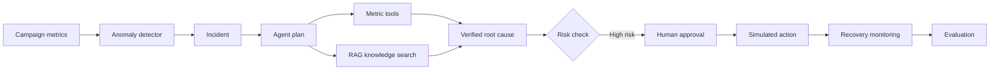
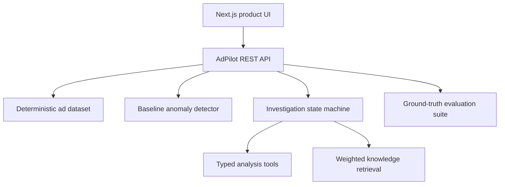

# AdPilot

**AI-powered advertising anomaly analysis and automated response platform.**

AdPilot is a portfolio-grade internal productivity tool inspired by advertising
monetization workflows. It detects anomalies in a reproducible campaign dataset,
investigates them with a tool-using agent, retrieves approved runbooks and
historical cases, requires human approval for risky actions, and evaluates every
stage against a ground-truth suite.

> All advertising data and response actions are simulated. The public demo uses
> no paid model or external advertising API.

## Live demo

https://adpilot-ai-ops.b-ryceboyd30668.chatgpt.site

The demo supports Chinese and English. Three seeded incidents are available:

1. US mobile CTR decline after a landing-page latency regression.
2. DE desktop spend spike after an incorrect bid multiplier.
3. UK mobile revenue decline after a conversion-tag change.

## Product workflow



## Architecture



The browser normally reads through the API. A local deterministic fallback keeps
the demo usable when an API request fails.

## API

| Endpoint | Purpose |
| --- | --- |
| `GET /api/metrics?market=US&device=Mobile` | Filtered metrics, summary, and trend |
| `GET /api/anomalies` | Detected incidents and detector quality |
| `GET /api/investigations/:id` | Agent workflow and tool trace |
| `POST /api/investigations/:id/approve` | Explicit simulated approval |
| `GET /api/knowledge?q=latency` | Ranked knowledge hits with citations |
| `GET /api/evaluations` | Detector, retrieval, agent, and cost metrics |

## Run locally

Requirements: Node.js 22+ and either npm or pnpm.

```bash
git clone <your-github-repository-url>
cd adpilot
npm run demo
```

Or run the steps manually:

```bash
npm install
npm run dev
```

Open the local URL printed in the terminal. The demo seeds itself automatically;
no database, API key, or paid service is required.

## Test

```bash
npm test
```

The suite verifies:

- product shell rendering;
- filtered metrics API output;
- 3/3 ground-truth anomaly detection with zero false positives;
- ranked knowledge retrieval with citations;
- explicit approval guardrails and simulated execution.

## Trust and safety boundaries

- No real advertising account is connected.
- All write actions are simulated.
- High-risk actions require explicit approval.
- Agent conclusions expose their data and knowledge sources.
- Retrieval returns citations and refuses unsupported results.
- The deterministic mode costs `$0` per run.

## Tech stack

- TypeScript, React, Next.js-compatible Vinext runtime
- Cloudflare Worker-compatible API routes
- Deterministic campaign data and statistical baseline rules
- Tool-based agent workflow with an auditable state machine
- Local weighted retrieval over approved runbooks and historical cases
- Node test runner for end-to-end API verification

## Interview demo

1. Filter to **US / Mobile** and inspect the revenue and CTR trend.
2. Open **Incidents** and select `INC-2407`.
3. Review the agent tool trace and cited runbook.
4. Approve the simulated rollback.
5. Open **Evaluations** and explain precision, recall, F1, and zero paid API cost.

## Roadmap

- Optional vector embeddings and reranking behind the same retrieval interface.
- Durable multi-user incident history.
- Optional bring-your-own-model adapter.
- Real advertising connectors behind read-only permissions.
