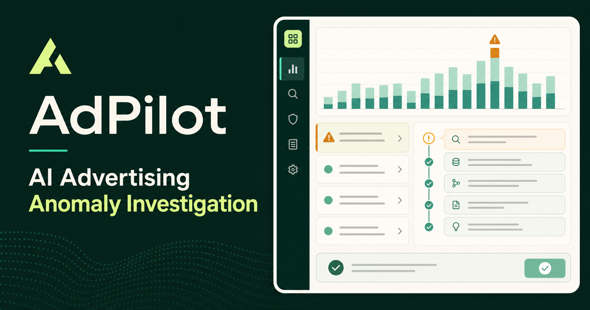
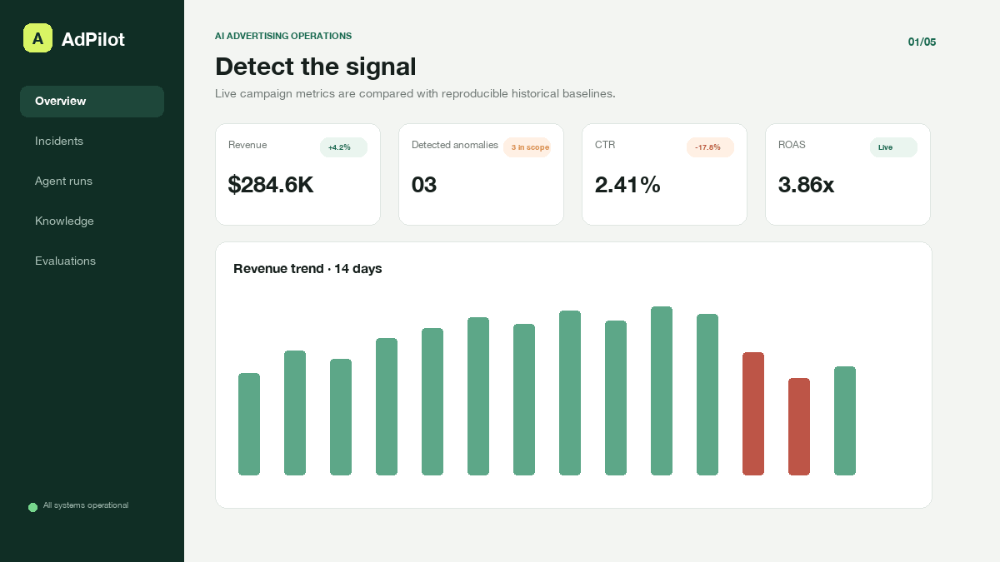
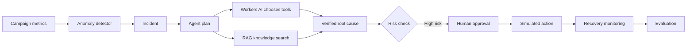
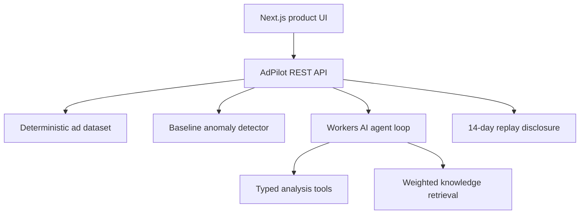

# AdPilot

**AI-powered advertising anomaly analysis and automated response platform.**

[](https://github.com/kaiying-coder/adpilot/actions/workflows/ci.yml)
[](https://adpilot-ai-ops.kaiying-coder.workers.dev)
[](./LICENSE)

AdPilot is a portfolio-grade internal productivity tool inspired by advertising
monetization workflows. It detects anomalies in a reproducible campaign dataset,
investigates `INC-2407` with a live Workers AI tool loop, retrieves approved runbooks and
historical cases, requires human approval for risky actions, and evaluates every
stage with an explicit 14-day replay disclosure.

> All advertising data and response actions are simulated. `INC-2407` uses real
> inference through Cloudflare Workers AI; it needs no paid API key and is designed
> to stay within Cloudflare's daily free allocation during portfolio demos.

## Live demo

https://adpilot-ai-ops.kaiying-coder.workers.dev



### Product workflow preview

The animation below is a product-workflow walkthrough generated from the same
five modules used in the live demo; it is not a recording of a real ad account.



The demo supports Chinese and English. Three seeded incidents are available:

1. US mobile CTR decline after a landing-page latency regression.
2. DE desktop spend spike after an incorrect bid multiplier.
3. UK mobile revenue decline after a conversion-tag change.

## Why this project fits an AI engineering productivity role

| Job signal | Evidence in AdPilot |
| --- | --- |
| AI coding and software engineering | Typed React/TypeScript product, eight REST routes, automated tests |
| Internal AI productivity tooling | Replaces manual alert triage, evidence collection, and incident reporting |
| Product sense | Prioritized incident queue, explainable evidence, human approval, recovery monitoring |
| Agent automation | Live Llama tool loop for INC-2407 plus an auditable approval state machine |
| RAG | Approved runbooks and historical cases with ranked retrieval and citations |
| Evaluation | Honest 14-day replay thresholds, sensitivity trade-off, live tool evidence, and cost boundary |

This is intentionally one coherent product rather than three unrelated demos:
the knowledge base grounds the agent, the agent automates the investigation,
and the evaluation center measures whether the automation is trustworthy.

## Product workflow



## Architecture



The browser normally reads through the API. A local deterministic fallback keeps
the demo usable when an API request fails.

## API

The API uses simulated advertising data. Statistical scanning is deterministic;
`INC-2407` calls a real Workers AI model through a binding and does not require
the visitor to supply an API key. See the complete
[OpenAPI specification](./openapi.yaml).

| Endpoint | Purpose |
| --- | --- |
| `GET /api/metrics?market=US&device=Mobile` | Filtered metrics, summary, and trend |
| `GET /api/anomalies` | Detected incidents and detector quality |
| `POST /api/anomalies/scan` | Inject and scan a new, non-preset anomaly |
| `GET /api/investigations/:id` | Agent workflow and tool trace |
| `POST /api/investigations/INC-2407/run` | Live Workers AI tool loop |
| `POST /api/investigations/:id/approve` | Explicit simulated approval |
| `GET /api/knowledge?q=latency` | Ranked knowledge hits with citations |
| `GET /api/evaluations` | Detector, retrieval, agent, and cost metrics |

Try the live read-only endpoints:

- [US mobile metrics](https://adpilot-ai-ops.kaiying-coder.workers.dev/api/metrics?market=US&device=Mobile)
- [Detected anomalies](https://adpilot-ai-ops.kaiying-coder.workers.dev/api/anomalies)
- [Evaluation report](https://adpilot-ai-ops.kaiying-coder.workers.dev/api/evaluations)

## Run locally

Requirements: Node.js 22+ and either npm or pnpm.

```bash
git clone https://github.com/kaiying-coder/adpilot.git
cd adpilot
npm run demo
```

Or run the steps manually:

```bash
npm install
npm run dev
```

Open the local URL printed in the terminal. The demo seeds itself automatically;
no database, API key, or paid service is required.

## Test

```bash
npm test
```

The suite verifies:

- product shell rendering;
- filtered metrics API output;
- declared-threshold replay finding 3/3 known incidents;
- new anomaly injection and full-table scanning;
- a mocked end-to-end Workers AI tool loop for deterministic CI;
- ranked knowledge retrieval with citations;
- explicit approval guardrails and simulated execution.

## Trust and safety boundaries

- No real advertising account is connected.
- All write actions are simulated.
- High-risk actions require explicit approval.
- Agent conclusions expose their data and knowledge sources.
- Retrieval returns citations and refuses unsupported results.
- The live model uses the Workers AI binding and Cloudflare's free daily allocation;
  no paid third-party API key is stored or exposed.

## Tech stack

- TypeScript, React, Next.js-compatible Vinext runtime
- Cloudflare Workers + Workers AI (`@cf/meta/llama-3.1-8b-instruct-fp8`)
- Statistical z-score/changepoint detection over 14-day campaign data
- LLM-selected tools with computed observations and a concise decision trace
- Local weighted retrieval over approved runbooks and historical cases
- Node test runner for end-to-end API verification

## Interview demo

1. Select `INC-2407` and click **Run live AI investigation**.
2. Point to each model-selected tool and the computed `σ` / latency observations.
3. Stop at the approval gate and explain why rollback is not automatic.
4. Close with the simulated `$18.2K/day` revenue impact and `4h → 3m` investigation story.
5. Inject a new anomaly to show the detector is not replaying only three canned cards.

## Roadmap

- Optional vector embeddings and reranking behind the same retrieval interface.
- Durable multi-user incident history.
- Evaluation against a larger labeled replay set.
- Real advertising connectors behind read-only permissions.

## License

[MIT](./LICENSE)
